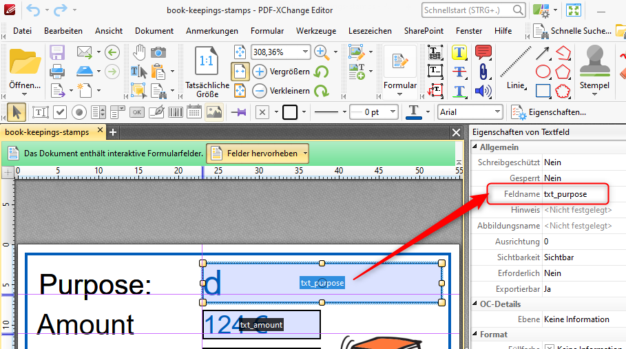

# How to create a ready to remit pdf stamp with PDF-Xchange

## Mission

You get an invoice as PDF and want to add some comments about paying, checking etc.
Create a dynamic stamp onto a PDF file like this and save it within the PDF-file.

### Before:


### After:


## Software needed

PDF-stamps are a very old technique in PDF. Everything works with original Acrobat-software.
But Acrobat is to expensive in our environment. So we use:

* Windows
* PDF-Xchange Editor Plus which allows creation of "dynamic stamps" which we need here

PDF X-Change comparison of versions can be found here:

* https://www.pdf-xchange.de/pdf-xchange/vergleichstabelle.htm 

(English links welcome).


## Files to download for you

* [example_invoice.pdf](example_invoice.pdf)
* [javascript_stamp_dialog_english_v1.js](javascript_stamp_dialog_english_v1.js) with the Javascript you have to include into your pdf-stamp-file
* [6d23c49d-06b5-4de8-b4430a79bb5babd2.pdf](6d23c49d-06b5-4de8-b4430a79bb5babd2.pdf), ready stamp pdf-file copy into your stamp-folder


## Step-by-step instructions

### Open the directory with stamps of PDF Xchange

* Click on "Windows" left bottom and type: cmd - to open a "DOS-window"
* Type: start c:\users\%username%\appdata 


* You will NOT find this folder by navigating with the explorer-window!
* Navigate further to c:\users\%username%\appdata\Roaming\Tracker Software\PDFXEditor\3.0\Stamps
* There will be no file in this directory, we will create this in a minute


### Create an empty stamp file in PDF Xchange

Open the program PDF Xchange. Create a new empty PDF-document with the measure of your new stamp


Create a new stamp file from this new document:


In this moment a new file appears in: 

c:\users\%username%\appdata\Roaming\Tracker Software\PDFXEditor\3.0\Stamps

Close PDF Xchange, so that the just created file is not locked.

The filename is an arbitrary hash-value created by the PDF Xchange program:


The filename doesn't matter for PDF Xchange but I rename it to something which matters to me: book-keepings-stamps.pdf


*Move* the file to c:\temp (your temporary working-directory where PDF Xchange does not lock files)


## A little review

* We have the program PDF Xchange and created an empty PDF-file with measure of our stamp 55x35 mm.
* We created a new stamp-file with a crazy name located in c:\users\%username%\appdata\Roaming\Tracker Software\PDFXEditor\3.0\Stamps
* We renamed that file to something human readable
* We moved the file to c:\temp


## Add fixed parts of your stamp

* Open c:\temp\book-keepings-stamps.pdf with the program PDF Xchange
* Create the fix parts of your stamp which consists of border, texts and a picture
* 


## Add form-fields to stamp pdf-file

Add form-fields to stamp pdf-file:


Give every form-field a name like this:



You can download the ready file with fix and variable parts (but no javascript which we will add in a minute) here: 
[book-keepings-stamps-v1-without-javascript.pdf]()


## Add Javascript into the first form field

Do exactly what I tell you here:

* Click on "Form"
* Click to the first field (here txt_purpose)


* Right click on the field -> properties. An extra box "properties of textfield" appears
* Go to the very end of the box (4)
* You find a field "calculation of values" -> select "own action" (5)
* Select "Execute Javascript"
* Click onto the three dots
* A Javascript window appears like this:


## The javascript to add

Download the javascript code here: [javascript_stamp_dialog_english_v1.js]()

```javascript
// save context of the stamp-pdf to a variable
var mystamp = this;


console.println("event.source.stampName = " + event.source.stampName);
//if (event.source.forReal && event.source.stampName == "#aFmkX0m3X7Q0X6UmM6vBb2") {
//    app.execDialog(my_dialog());
//}

function today_mmddyyyy() {
    var h = util.printd("dd.mm.yyyy", new Date());
    return h;
}

function amount_default() {
    return "0,00";
}

function costunit_possible_values() {
    return {
        "0601.5620 (training)": +100,
        "0601.6374 (service)": +99,
		"0601.5200 (small parts)": +98,
        "0601.9350 (machines)": +98
    }
}

function responsible_possible_values() {
    return {
		"Doe, John": +100,
		"Wendish, Kevin": +99,
		"Bull, Sandra": +98
    }
}

function find_costunit_from_dialog(dialog) {
	var items = dialog.store()["costunit"];
    var found_costunit = '';
	for (var item in items) {
        if (items[item] > 0) {
            console.println(item);
            found_costunit = item;
            break;
        }
    }
    // costunit has a comment in round brackets in the end
    // 1234 (misc) -> 1234
    found_costunit = found_costunit.replace(/\(.*$/, "");
    return found_costunit;
}

function find_responsible_from_dialog(dialog) {
	var items = dialog.store()["responsible"];
    var found_responsible = '';
	for (var item in items) {
        if (items[item] > 0) {
            console.println(item);
            found_responsible = item;
            break;
        }
    }
    return found_responsible;
}

function find_complete_part_from_dialog(dialog) {
    var active_text;

    // das sind Radio-Buttons
    const complete_partial_mapper = {
        "radio_part": "Part only",
        "radio_complete": "Complete Pay"
    };

    for (var key in complete_partial_mapper) {
        var sa = dialog.store()[key];
        if (! sa) {
            continue;
        }
        active_text = complete_partial_mapper[key];
        break;
    }
    return active_text;
}

function currency() {
    return "€";
}

function purpose_default() {
    return "";
}

function determine_purpose_text_from_dialog(dialog) {
    var purpose = "(no purpose)";
    if (dialog.store()["purpose"]) {
        purpose = dialog.store()["purpose"];
    }
    return purpose;
}

function my_dialog() {
    var dialog = {
        initialize: function(dialog) {
            dialog.load({
                "readydate": today_mmddyyyy(),
                "responsible": responsible_possible_values(),
                "costunit": costunit_possible_values(),
                "amount": amount_default(),
                "purpose": purpose_default()
            });
        },
        commit: function(dialog) { // called when OK pressed
            var results = dialog.store();

            // Eintragen der Daten aus dem Dialogfeld in das PDF
            mystamp.getField("txt_costunit").value = find_costunit_from_dialog(dialog);
            mystamp.getField("txt_amount").value = results["amount"] + " " + currency();
            mystamp.getField("txt_purpose").value = determine_purpose_text_from_dialog(dialog);
            mystamp.getField("txt_date").value = results["readydate"];
            mystamp.getField("txt_complete_part").value = find_complete_part_from_dialog(dialog);
            mystamp.getField("txt_responsible").value = find_responsible_from_dialog(dialog);
            mystamp.getField("txt_readytoremit").value = "Ready to remit!";
        },
        description: {
            name: "Ready to remit money", // Dialog box title
            align_children: "align_left",
            width: 350,
            height: 200,
            elements: [{
                    type: "cluster",
                    name: "The details",
                    align_children: "align_left",
                    elements: [
                        {
                            type: "view",
                            align_children: "align_row",
                            elements: [
                                {
                                    type: "static_text",
                                    name: "Purpose: "
                                },
                                {
                                    type: "gap",
                                    width: 28,
                                },
                                {
                                    item_id: "purpose",
                                    type: "edit_text",
                                    alignment: "align_fill",
                                    width: 100,
                                    height: 20
                                }
                            ]
                        },
                        {
                            type: "view",
                            align_children: "align_row",
                            elements: [
                                {
                                    type: "static_text",
                                    name: "Cost unit: "
                                },
                                {
                                    type: "gap",
                                    width: 58,
                                },
                                {
                                    item_id: "costunit",
                                    type: "popup",
                                    alignment: "align_fill",
                                    width: 200,
                                    height: 20
                                }
                            ]
                        },
                        {
                            type: "view",
                            align_children: "align_row",
                            elements: [
                                {
                                    type: "static_text",
                                    name: "Complete/Part:"
                                },
                                {
                                    type: "gap",
                                    width: 24,
                                },
                                {
                                type: "radio",
                                group_id: "complete_part",
                                item_id: "radio_complete",
                                name: "Complete Pay",
                                },
                                {
                                type: "radio",
                                group_id: "complete_part",
                                item_id: "radio_part",
                                name: "Partial Pay",
                                },

                            ]
                        },
                        {
                            type: "view",
                            align_children: "align_row",
                            elements: [
                                {
                                    type: "static_text",
                                    name: "Amount: "
                                },
                                {
                                    type: "gap",
                                    width: 28,
                                },
                                {
                                    item_id: "amount",
                                    type: "edit_text",
                                    alignment: "align_fill",
                                    width: 100,
                                    height: 20
                                },
                                {
                                    type: "static_text",
                                    name: "Euro"
                                }
                            ]
                        },
                        {
                            type: "view",
                            align_children: "align_row",
                            elements: [
                                {
                                    type: "static_text",
                                    name: "Date: "
                                },
                                {
                                    type: "gap",
                                    width: 50,
                                },
                                {
                                    item_id: "readydate",
                                    type: "edit_text",
                                    alignment: "align_left",
                                    width: 100,
                                    height: 20
                                }
                            ]
                        },
                        {
                            type: "view",
                            align_children: "align_row",
                            elements: [
                                {
                                    type: "static_text",
                                    name: "Responsible: "
                                },
                                {
                                    item_id: "responsible",
                                    type: "popup",
                                    alignment: "align_fill",
                                    width: 200,
                                    height: 20
                                }
                            ]
                        },

                    ]
                },
                {
                    alignment: "align_right",
                    type: "ok_cancel",
                    ok_name: "Ok",
                    cancel_name: "Cancel"
                }
            ]
        }
    };
    return dialog;
}
```

## Save the file and copy to the right place


## Use your stamp

Now you can open any pdf-file and insert a pdf-stamp:


A popup-dialog appears:


Press ok and your stamp appears in your document, save the PDF-file.


## Where to find more information

* https://acrobatusers.com/tutorials/dynamic_stamp_secrets/
* Book "All About PDF Stamps", Author Thom Parker, WindJack Press, ISBN 978-0985614706
* http://dev.datalogics.com/cookbook/document/AcrobatDC_js_api_reference.pdf
* https://www.luis.uni-hannover.de/fileadmin/kurse/material/pdfWorkWithAcrobat/adobe_JavaScript.pdf
* https://help.tracker-software.com/pdfxe7/PDFXED7_MAN.pdf
* https://www.pdfscripting.com/


